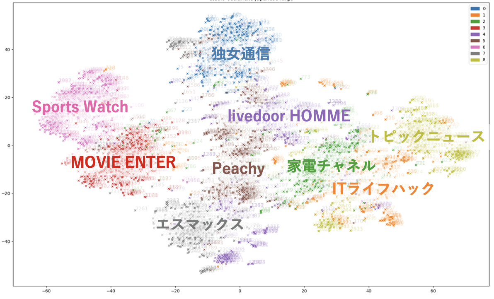

# Embeddings
## 客観的Embeddings評価



データセット、`shunk031/livedoor-news-corpus`を使用したEmbeddingsの分布から、モデルの精度の検証を行う。  

検証環境は[okitalabs/LLMdev
](https://github.com/okitalabs/LLMdev)を使用する前提。

<hr>

## 評価方法
- ライブドアニュース（9カテゴリ、300件ずつ、計2700件）  
- Embeddingsは512文字  
- EmbeddingsのCos類似度で、上位3件が同じカテゴリかどうか
- 同じカテゴリ数/全カテゴリ数 = 100点満点
- t-SNEで2次元に次元削減した座標でプロット
- カテゴリが綺麗に分かれている程、分類性能が高いとする基準

<hr>

## データセット作成
ライセンス上、加工したデータセットを添付できないため、オリジナルから作成する。

[100.dataset_liveddor.ipynb](examples/100.dataset_liveddor.ipynb)

- ライブドアニュース、9カテゴリ、各300件、計2700件、戦闘から512文字を抽出
- HuggingFaceの[shunk031/livedoor-news-corpus](https://huggingface.co/datasets/shunk031/livedoor-news-corpus)を使用する
- `livedoor_300.csv.zip`として保存


## Embeddings評価

`livedoor_300.csv`の例文をEmbeddingsし、評価を行うサンプルプログラム。

### 実装でEmbeddings
`langchain.embeddings`の`HuggingFaceEmbeddings`を使用し、プログラム内でモデルを起動しEmbeddingを行う場合。  
[200.HuggingFaceEmbeddings.ipynb](examples/200.HuggingFaceEmbeddings.ipynb)


### OpenAI APIでEmbeddigs
`OpenAI.embeddings.create`を使用し、OpenAI APIでEmbeddingサーバにリクエストを投げてしEmbeddingを行う場合。  
[300.OpenAIAPI.ipynb](examples/300.OpenAIAPI.ipynb)

<hr>

## Embeddingsサーバ
### Sentence Transformer（LocalAI）
BERT系のOpenAI API Embeddingsサーバの建て方。　　
LocalAIを使用してSentence Transformerを実行する。

1. localaiのDockerイメージからコンテナを起動
    ```
    $ docker run -itd --gpus all \
    -p 28080:8080 \
    -h local-ai --name localai localai/localai:latest-gpu-nvidia-cuda-12
    ```

2. コンテナにログイン
    ```
    $ docker exec -it localai /bin/bash
    ```

3. vimをインストール
    ```
    root@localai:/build# apt update
    root@localai:/build# apt install vim -y

    ```

4. /build/modelsディレクトリにモデルの設定ファイルを作成
    ```
    root@localai:/build# vi models/intfloat-multilingual-e5-small.yaml
    name: intfloat-multilingual-e5-small
    backend: sentencetransformers
    embeddings: true
    parameters:
    model: intfloat/multilingual-e5-small
    ```

5. ホストからAPIでEmbeddingsにアクセス
初回アクセス時はモデルのダウンロードをするため時間がかかる
    ```
    $ curl http://localhost:28080/v1/embeddings \
    -H "Content-Type: application/json" \
    -H "Authorization: Bearer None" \
    -d '{
    "model": "intfloat-multilingual-e5-small",
    "input": "query: 夕飯はお肉です。"
    }' 
    ```

6. 以降は普通にアクセス（即時応答）出来る


注意点
- Dockerイメージはかなり大きい  
    localai/localai   latest-gpu-nvidia-cuda-12   c7671b3bc4f4   3 weeks ago   41.3GB  
- 設定ファイル、ダウンロードしたモデルファイルは /build/models に置かれるこのディレクトリをDockerでマウントすることにより、設定の保存が出来る
- 未定義のモデル名を指定すると、GRPCプロセスが大量に発生するので注意
- SentenceTranseformerのOpenAI API互換サーバを立てる方法は現状ではLocalAIしかない


### FastChat
GPT系のOpenAI API Embeddingsサーバの建て方。　　
FastChatの`controller`, `model_worker`、`openai_api_server`の3つのプロセスを起動する。

#### インストール
GitHubからダウンロードしてインストールする。
```
git clone https://github.com/lm-sys/FastChat.git
cd FastChat
pip3 install -e .
```

#### 実行  
`line-corporation/japanese-large-lm-1.7b`をダウンロードして実行する例。  

```
python3 -m fastchat.serve.controller --host 0.0.0.0 2>&1 &

python3 -m fastchat.serve.model_worker --model-names "gpt-3.5-turbo,text-davinci-003,text-embedding-ada-002" --model-path line-corporation/japanese-large-lm-1.7b --num-gpus 1 --host 0.0.0.0 2>&1 &

python3 -m fastchat.serve.openai_api_server --host 0.0.0.0  --port 8000 2>&1 &
```

#### 停止
```
ps -ef | grep fastchat | awk '{print $2}'|xargs kill -9
```

<hr>

LLM実行委員会